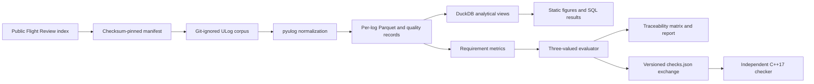

# px4-reqcheck

Python, Parquet, and DuckDB pipeline for reproducibly evaluating public PX4 telemetry against machine-readable flight requirements.

**55 tests** · [](https://github.com/Sevens-Dev/px4-reqcheck/actions/workflows/ci.yml) · **187,231 telemetry rows/s median ingest** ([10 cold-cache runs and full measurement contract](docs/benchmarks/week2-results.md))

One-command report generation after corpus setup: `make all`

## What this is not

- It is not a reimplementation of PX4 Flight Review and does not analyze estimator internals, navigation performance, or controller design.
- It does not certify a vehicle or claim compliance with an aviation or PX4 standard.
- It reports evidence for this pinned corpus; it does not generalize pass rates to all PX4 flights.
- The C++ checker re-derives every verdict but independently recomputes only one raw-sample metric; 100% scalar-verdict agreement is otherwise by construction.

## Architecture



Raw logs are downloaded from the public service for local processing and are never committed or redistributed. The committed manifest, checksums, aggregate benchmark outputs, and source-verification ADR make the implemented path inspectable.

## Reproduction

From a clone, validate the source and tests:

```bash
uv sync --all-groups --locked
make check
```

Build the best-effort public corpus, normalize it, and generate the current figures:

```bash
make corpus
make ingest
make all
```

The published timing was reproduced on a clean Ubuntu 24.04 GitHub Actions hosted runner, not on the development host. Trigger the committed benchmark workflow and download its raw artifact:

```bash
gh workflow run benchmark.yml --ref main
gh run list --workflow benchmark.yml --limit 1
gh run download RUN_ID --name week2-benchmarks --dir benchmark-output
```

The committed requirement report is independently regenerated from the real corpus and compared byte-for-byte in a second manual workflow:

```bash
gh workflow run real-corpus.yml --ref main
gh run list --workflow real-corpus.yml --limit 1
gh run download RUN_ID --name real-corpus-report --dir reproduced-report
```

[Hosted reproduction run 35448528237](https://github.com/Sevens-Dev/px4-reqcheck/actions/runs/35448528237) passed the full `make all` gate and exact report comparison on commit `0bf2d5e`.

The benchmark artifact records CPU, RAM, runner type, exact commands, tool versions, all repetitions, timed regions, and cold-cache procedure. The preregistered 5× DuckDB hypothesis did not hold: on this 20-log slice, indexed SQLite was faster on all three named queries. DuckDB remains the operational choice because it queries Parquet directly without a materialization step; this is not a universal speed claim.

The Python/C++ checker boundary agreed on all 140 requirement/log verdicts. C++ independently reproduced every available pre-landing descent p95 within absolute `1e-6`. The checker-only [timing table](docs/benchmarks/cpp-timing.md) reports 20 runs per implementation and explicitly excludes ULog parsing; it is not a pipeline-speed claim.

Ordinary CI runs the three-fixture tier-1 golden gate. The downloaded 20-log tier-2 gate remains manual: `gh workflow run golden-corpus.yml --ref main`. It requires exact verdicts and tolerance-bounded metrics. The selected [root-cause memo](docs/memos/landing-rate-violation-0d728b7d.md) traces a sustained pre-landing descent-rate violation and names the corpus regression that guards it.

## Current scope

- Deterministic 20-log PX4 v1.15 corpus manifest with SHA-256 checksums and 404 tolerance.
- Whitelist-bounded ULog ingest into per-log Parquet using a half-core process pool.
- Reporting for timestamp monotonicity, gaps, duplicates, physical ranges, missing topics, sample rate, and additional topic instances; samples are reported, never silently dropped.
- Seven pure flight-metric functions with synthetic hand-computed tests.
- Seven machine-readable requirements with ordered aliases, sentinel-safe thresholds, exhaustive non-evaluable causes, and a committed 20-log traceability matrix.
- Five committed analytical SQL queries and two static Matplotlib figures.
- Preregistered DuckDB-versus-SQLite comparison with committed raw results and an explicit null result.
- Versioned Python/C++ exchange schemas, an independent raw-sample C++ descent implementation, a 140-verdict agreement gate, and committed checker timing evidence.
- Three committed synthetic Parquet fixtures form the tier-1 golden gate; CI fails if any of their 21 exact verdicts or tolerance-bounded metrics changes.
- Committed tier-2 expectations cover all 140 real-corpus pairs and run after the pinned download in a manual workflow.

The next milestone widens the corpus and adds denominator-aware statistical slicing.
