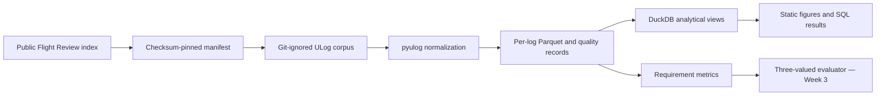

# px4-reqcheck

Python, Parquet, and DuckDB pipeline for reproducibly evaluating public PX4 telemetry against machine-readable flight requirements.

**55 tests** · [](https://github.com/Sevens-Dev/px4-reqcheck/actions/workflows/ci.yml) · **187,231 telemetry rows/s median ingest** ([10 cold-cache runs and full measurement contract](docs/benchmarks/week2-results.md))

One-command report generation after corpus setup: `make all`

## What this is not

- It is not a reimplementation of PX4 Flight Review; Flight Review renders one log, while this project evaluates a pinned corpus against explicit requirements.
- It does not analyze estimator internals, navigation performance, or controller design.
- It does not certify a vehicle or claim compliance with an aviation or PX4 standard.
- Current metrics and figures are an implementation milestone, not yet the final requirement-evaluation report.

## Architecture



Raw logs are downloaded from the public service for local processing and are never committed or redistributed. The committed manifest, checksums, aggregate benchmark outputs, and source-verification ADR make the implemented path inspectable.

## Reproduction

From a clone, validate the source and tests:

```bash
uv sync --all-groups --locked
make check
```

Build the best-effort public corpus, normalize it, and generate the current figures:

```bash
make corpus
make ingest
make all
```

The published timing was reproduced on a clean Ubuntu 24.04 GitHub Actions hosted runner, not on the development host. Trigger the committed workflow and download its raw artifact:

```bash
gh workflow run benchmark.yml --ref main
gh run list --workflow benchmark.yml --limit 1
gh run download RUN_ID --name week2-benchmarks --dir benchmark-output
```

The benchmark artifact records CPU, RAM, runner type, exact commands, tool versions, all repetitions, timed regions, and cold-cache procedure. The preregistered 5× DuckDB hypothesis did not hold: on this 20-log slice, indexed SQLite was faster on all three named queries. DuckDB remains the operational choice because it queries Parquet directly without a materialization step; this is not a universal speed claim.

## Current scope

- Deterministic 20-log PX4 v1.15 corpus manifest with SHA-256 checksums and 404 tolerance.
- Whitelist-bounded ULog ingest into per-log Parquet using a half-core process pool.
- Reporting for timestamp monotonicity, gaps, duplicates, physical ranges, missing topics, sample rate, and additional topic instances; samples are reported, never silently dropped.
- Seven pure flight-metric functions with synthetic hand-computed tests.
- Seven machine-readable requirements with ordered aliases, sentinel-safe thresholds, exhaustive non-evaluable causes, and a committed 20-log traceability matrix.
- Five committed analytical SQL queries and two static Matplotlib figures.
- Preregistered DuckDB-versus-SQLite comparison with committed raw results and an explicit null result.

The next milestone adds the independent C++ verdict checker and raw-sample descent metric.
